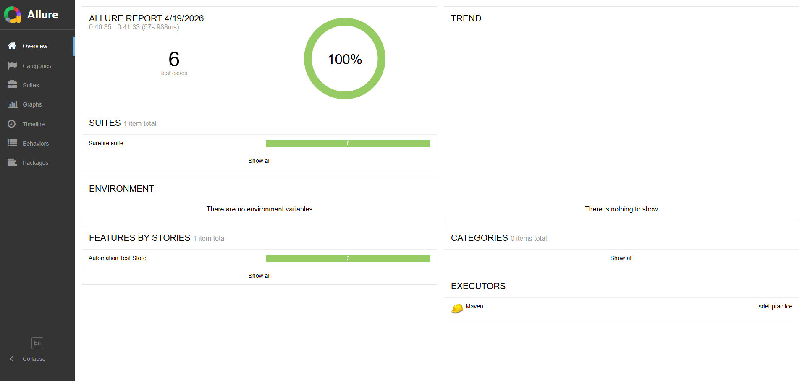
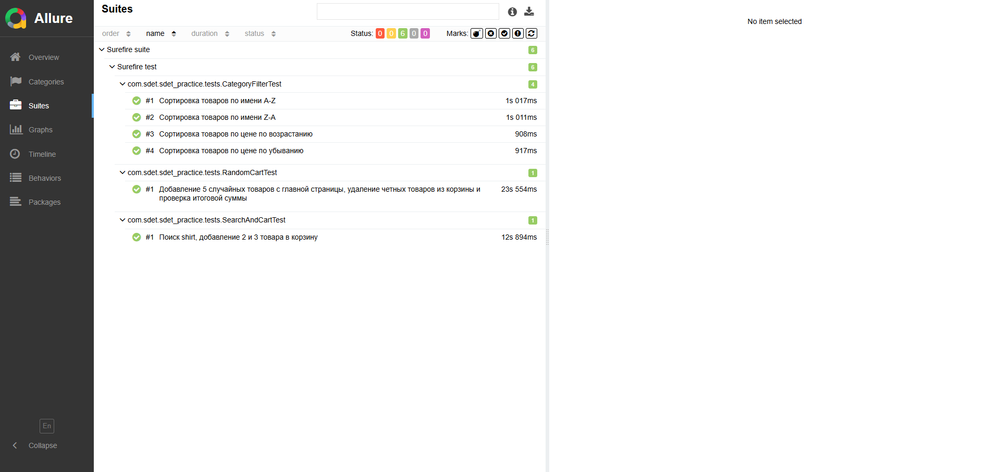
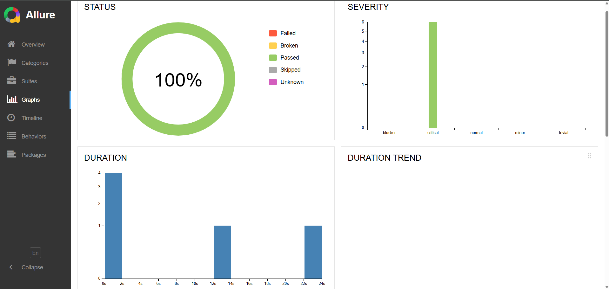

## Allure Report

### Overview

### Suites

### Graphs

## CI/CD

В проекте настроен автоматический запуск UI-тестов через GitHub Actions.

Workflow запускается:
- при push в ветки `main` и `dev/ui-test`
- при создании Pull Request в `main`

Pipeline выполняет:
- checkout проекта
- настройку Java 17
- запуск Maven тестов
- сохранение test reports и Allure results как artifacts